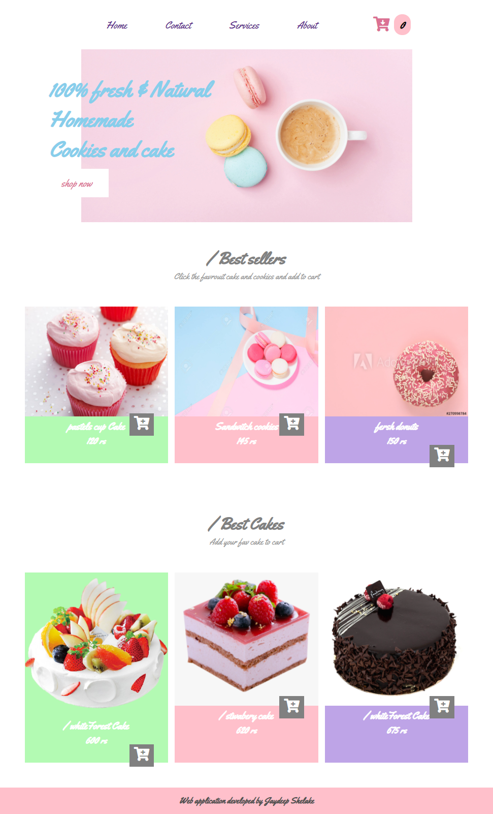

# Cart.js

  

 

> This web apllication is made for practice porpose ,the UI is made of cake shop and coustomer can add products to cart

## ⚙️ Detailed Functionality
* From this web application any one can add any procduct to cart
* Users can get the information like numbers of products in cart
* Users can get  total amount of price of items present in the cart 
 
## 🚀 Tech and Tools Used

* HTML,CSS and javascript
* VS code

## 📸 Screenshots

